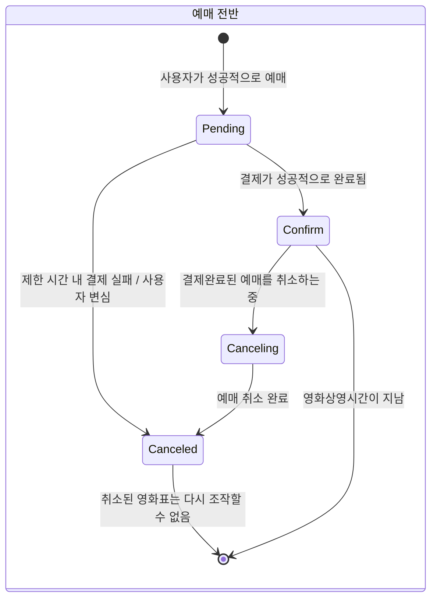
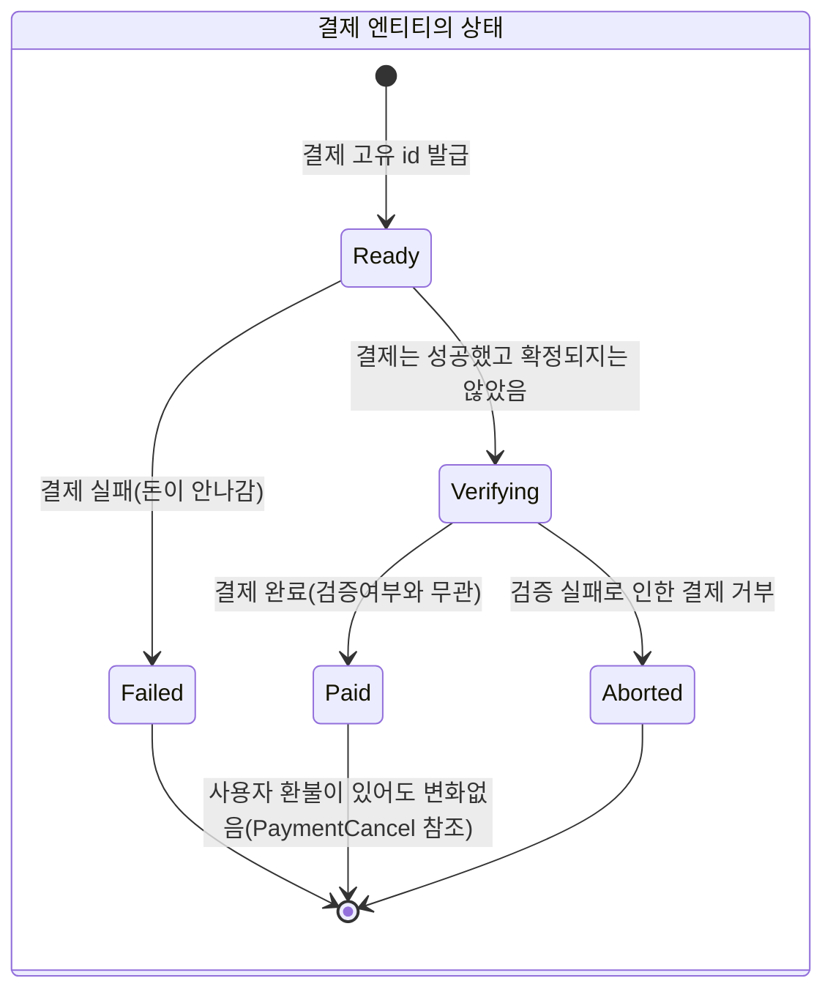
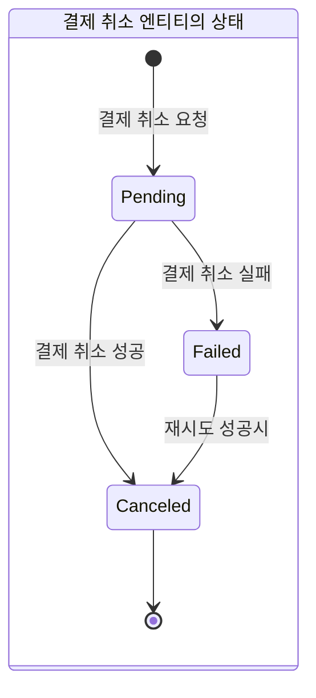
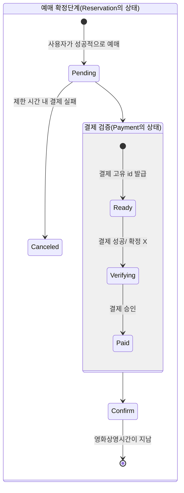
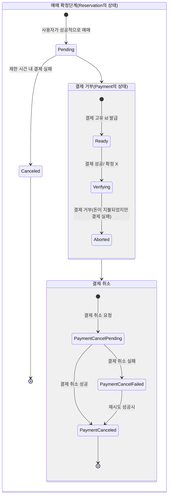

# 상태 다이어그램으로 보는 예매 시스템의 상태변화

## 예매의 상태변화

```mermaid
stateDiagram-v2
        state "예매 전반" as Reservation{
            [*] --> Pending : 사용자가 성공적으로 예매
            Pending --> Canceled : 제한 시간 내 결제 실패 / 사용자 변심
            Pending --> Confirm : 결제가 성공적으로 완료됨
            Confirm --> Canceling : 결제완료된 예매를 취소하는 중
            Canceling --> Canceled : 예매 취소 완료
            Confirm --> [*] : 영화상영시간이 지남
            Canceled --> [*] : 취소된 영화표는 다시 조작할 수 없음
        }
```

## Payment의 상태

```mermaid
stateDiagram-v2
    state "결제 엔티티의 상태" as Payment{
        [*] --> Ready : 결제 고유 id 발급
        Ready --> Failed : 결제 실패(돈이 안나감)
        Ready-->Verifying: 결제는 성공했고 확정되지는 않았음
        Verifying --> Paid : 결제 완료(검증여부와 무관)
        Verifying --> Aborted : 검증 실패로 인한 결제 거부
        Aborted --> [*]
        Failed --> [*]
        Paid --> [*] : 사용자 환불이 있어도 변화없음(PaymentCancel 참조)
    }
```

## PaymentCancel의 상태

```mermaid
stateDiagram-v2
        state "결제 취소 엔티티의 상태" as PaymentCancel{
            [*] --> Pending : 결제 취소 요청
            Pending --> Canceled : 결제 취소 성공
            Pending --> Failed : 결제 취소 실패
            Failed --> Canceled : 재시도 성공시
            Canceled --> [*]
        }
```

## 결제 성공 시나리오

```mermaid
stateDiagram-v2
        state "예매 확정단계(Reservation의 상태)" as Reservation{
            [*] --> Pending : 사용자가 성공적으로 예매
            Pending --> Payment
            state "결제 검증(Payment의 상태)" as Payment{
                [*] --> Ready : 결제 고유 id 발급
                Ready --> Verifying : 결제 성공/ 확정 X
                Verifying --> Paid : 결제 승인
            }
            Pending --> Canceled : 제한 시간 내 결제 실패
            Payment --> Confirm
            Confirm --> [*] : 영화상영시간이 지남
        }
```

## 결제 거부 시나리오

```mermaid
stateDiagram-v2
    state "예매 확정단계(Reservation의 상태)" as Reservation{
        [*] --> Pending : 사용자가 성공적으로 예매
        Pending --> Payment
        state "결제 거부(Payment의 상태)" as Payment{
            [*] --> Ready : 결제 고유 id 발급
            Ready --> Verifying : 결제 성공/ 확정 X
            Verifying --> Aborted : 결제 거부(돈이 지불되었지만 결제 실패)
        }
        Payment --> PaymentCancel
        state "결제 취소" as PaymentCancel {
            [*] --> PaymentCancelPending : 결제 취소 요청
            PaymentCancelPending --> PaymentCanceled : 결제 취소 성공
            PaymentCancelPending --> PaymentCancelFailed : 결제 취소 실패
            PaymentCancelFailed --> PaymentCanceled : 재시도 성공시
            PaymentCanceled --> [*]
        }
        Pending --> Canceled : 제한 시간 내 결제 실패
        Canceled--> [*]
    }
```
