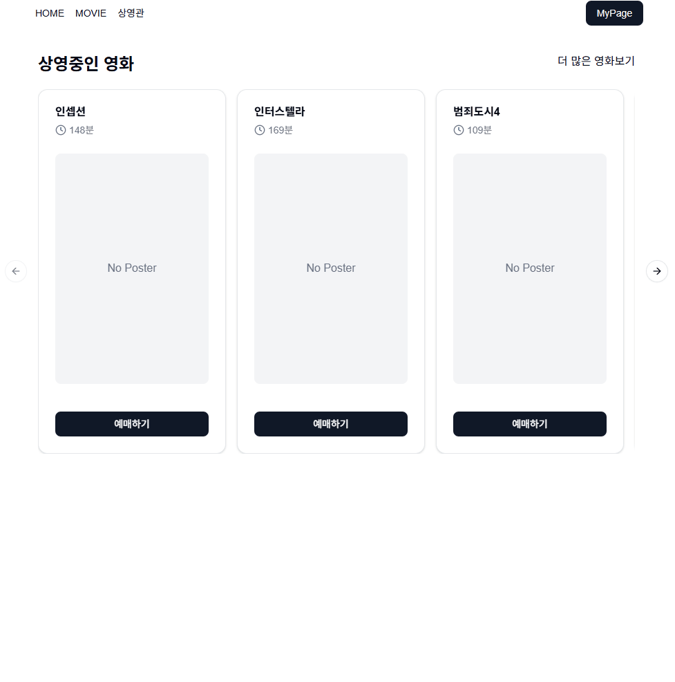
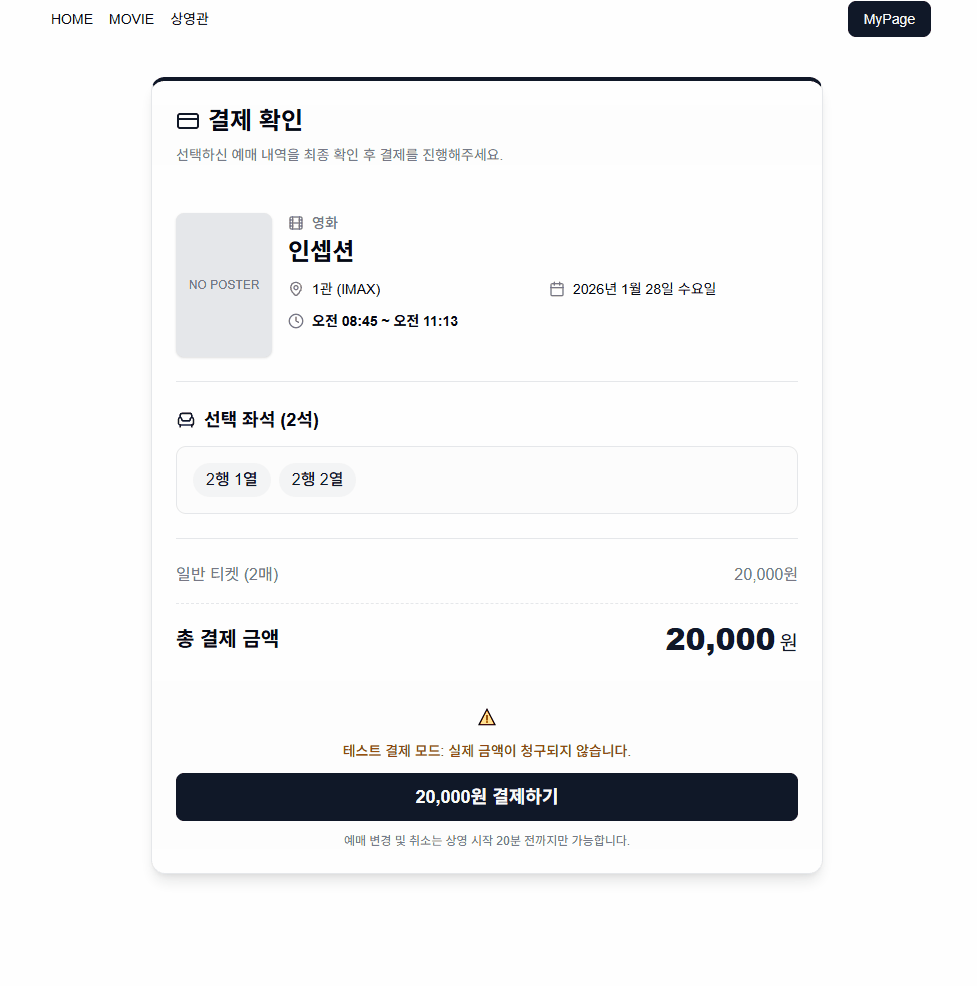
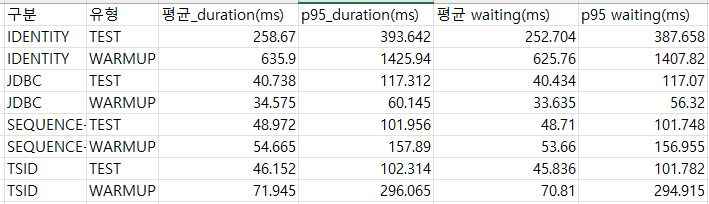
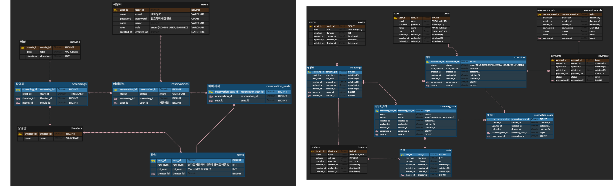

# 영화 예매 및 결제 시스템

목적: 단순히 기능을 구현하는 것을 넘어, 다수의 사용자가 동시에 좌석을 선점할 때 발생하는 Race Condition을 해결하고, 외부 결제 API 연동 과정에서 발생할 수 있는 분산 트랜잭션의 데이터 불일치를 엔지니어링적으로 풀어나가는 데 중점을 두었습니다.

## 바로가기

- 배포 URL : https://reservation-movie.vercel.app/
- API 서버 : https://movie.rejs.link/api

## Stack

Frontend: Next.js 16, Tailwind CSS  
Backend: Spring Boot 3, JPA, QueryDsl  
Infra: AWS EC2, Vercel, MySQL, Caddy (HTTPS/SSL), Docker
Database: MariaDB

## 주요 기능

- 영화 예매
  
- 예매 상태에서 결제를 통한 상태 예매 상태 확정
  

## 기술적 결정

### JPA ID 생성 전략으로 인한 쓰기 병목 제거

- 현상 : 영화관 생성시 좌석 400개 등 생성시 쓰기 병목 발생. 테일 레이턴시 300ms 이상
- 원인 : 영속성 컨텍스트의 IDENTITY 전략에 의한 문제
- 해결 : TSID 및 Sequence 등 대안을 비교 분석하여 성능 해결/ 테일레이턴시 380ms -> 100ms
  

### 동시예매시 락경합 분석, 세분화, 테스트

- **현상**: 잠금 대상(Resource)의 범위가 너무 넓어(Coarse-grained) 불필요한 대기 시간이 발생하며 시스템 가용성을 저해함.
- **설계 변경**: `ScreeningSeat` 엔티티를 도입하여 DB 설계를 재구성.
- **테스트 결과**: 락 범위 세분화만으로 추가 인프라 없이 유의미한 성능 향상 달성.

| 구분 (Lock Strategy)       |    평균 RPS     |   p95 Latency   | 비고                        |
| :------------------------- | :-------------: | :-------------: | :-------------------------- |
| **Screening Lock (A)**     |       220       |      184ms      | 광범위한 잠금 범위          |
| **ScreeningSeat Lock (B)** |     **241**     |    **166ms**    | **락 범위 세분화 완료**     |
| **개선 성과**              | **약 10% 증가** | **약 10% 감소** | **21 RPS 증가 / 18ms 단축** |

