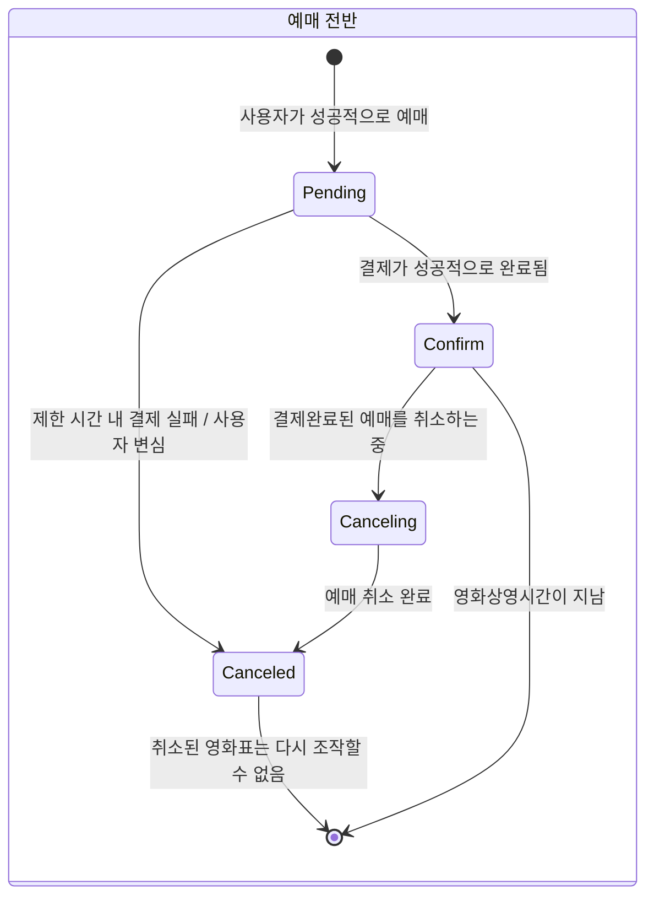
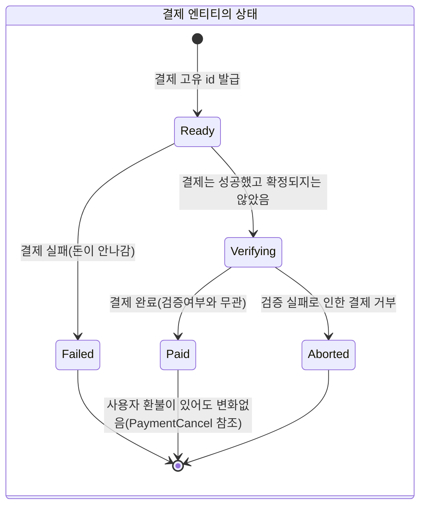
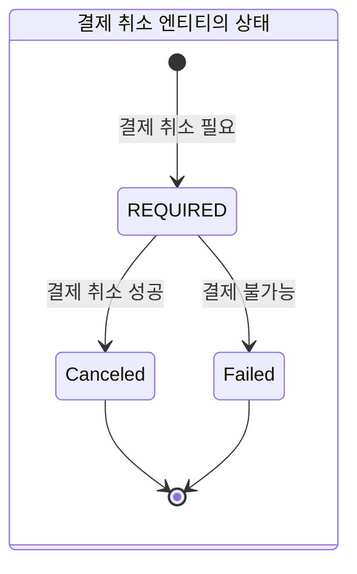
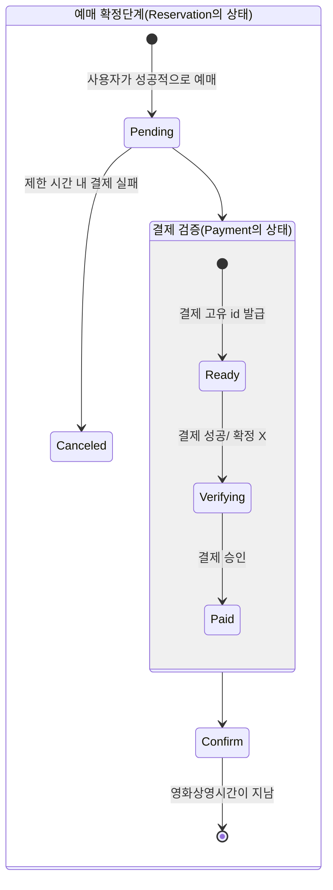
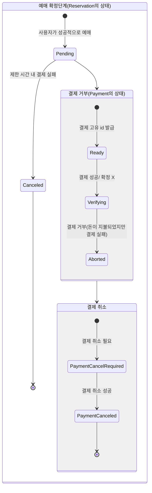
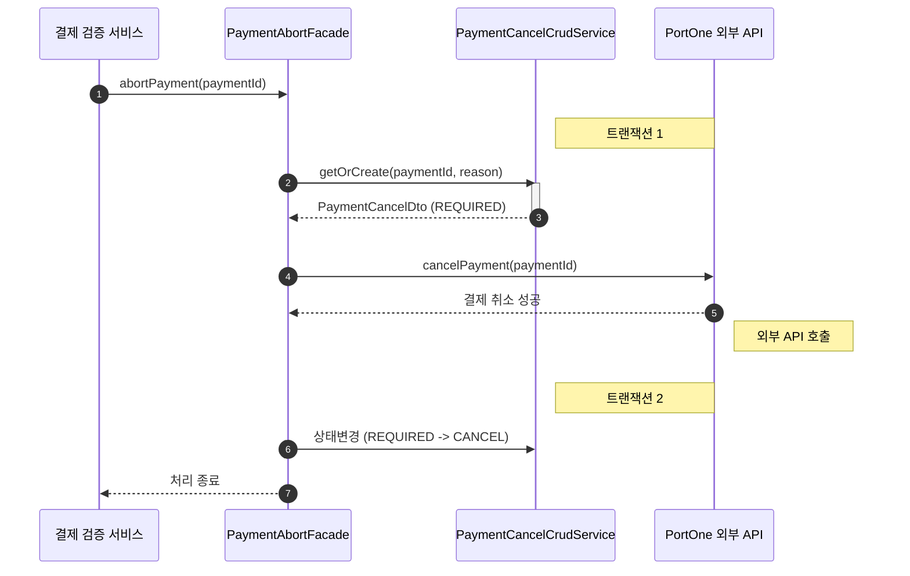
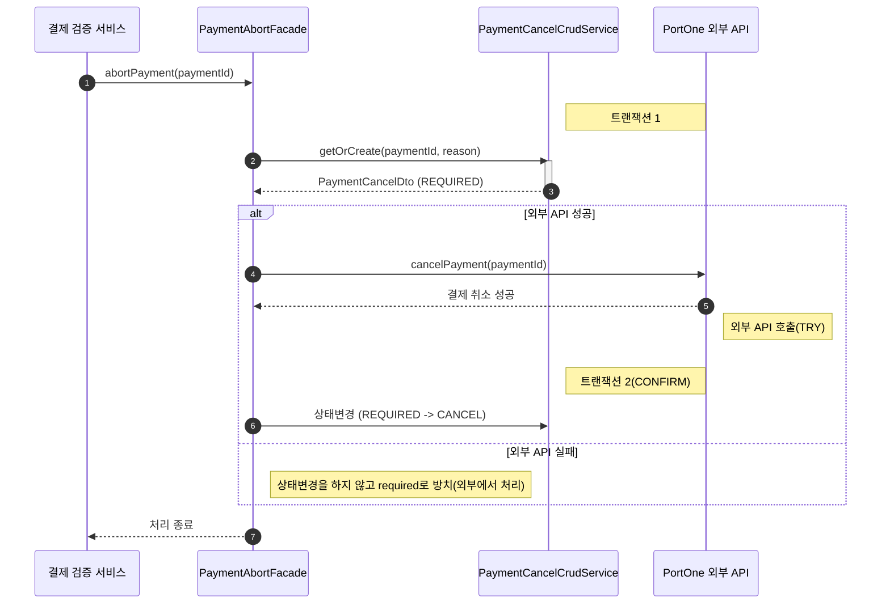
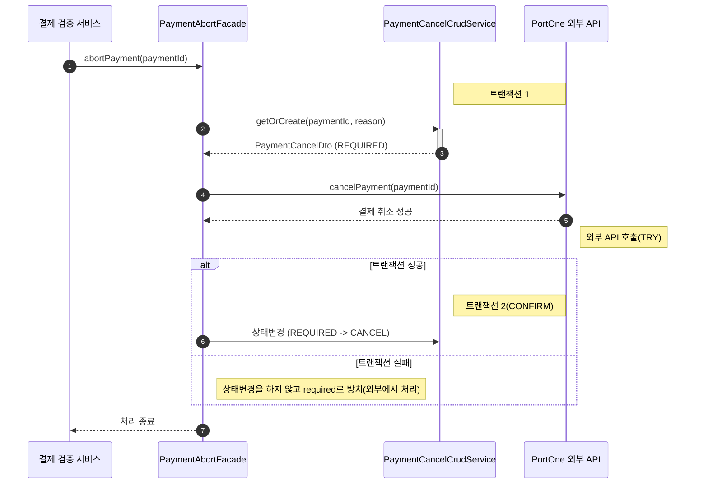
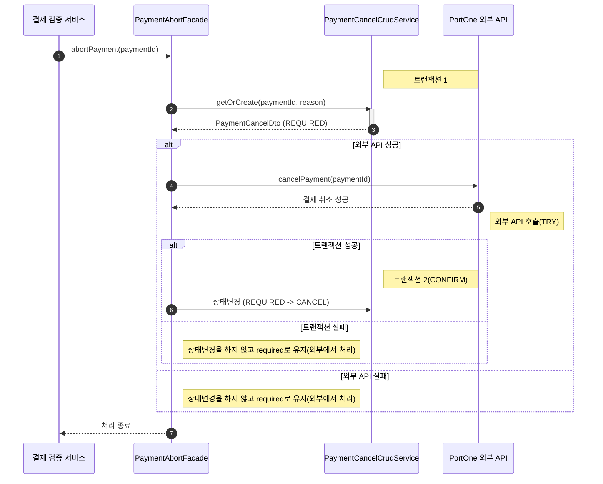

# 상태 다이어그램으로 보는 예매 시스템의 상태변화

## 예매의 상태변화

## Payment의 상태

## PaymentCancel의 상태

## 결제 성공 시나리오

## 결제 거부 시나리오

### 상태다이어그램

### 결제 거부에 대한 보상 트랜잭션

#### 성공시나리오

#### 외부 API 연동 실패 시나리오

#### 트랜잭션 2 Confirm / Cancel 실패 시나리오

#### 결론

