# 상태 다이어그램

## 예매의 상태변화

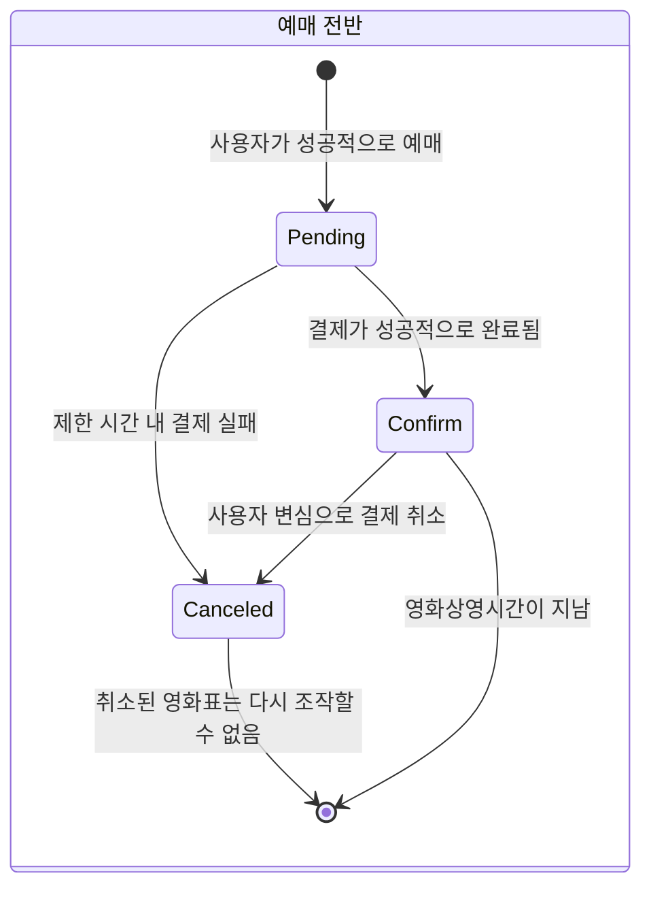

## Payment의 상태

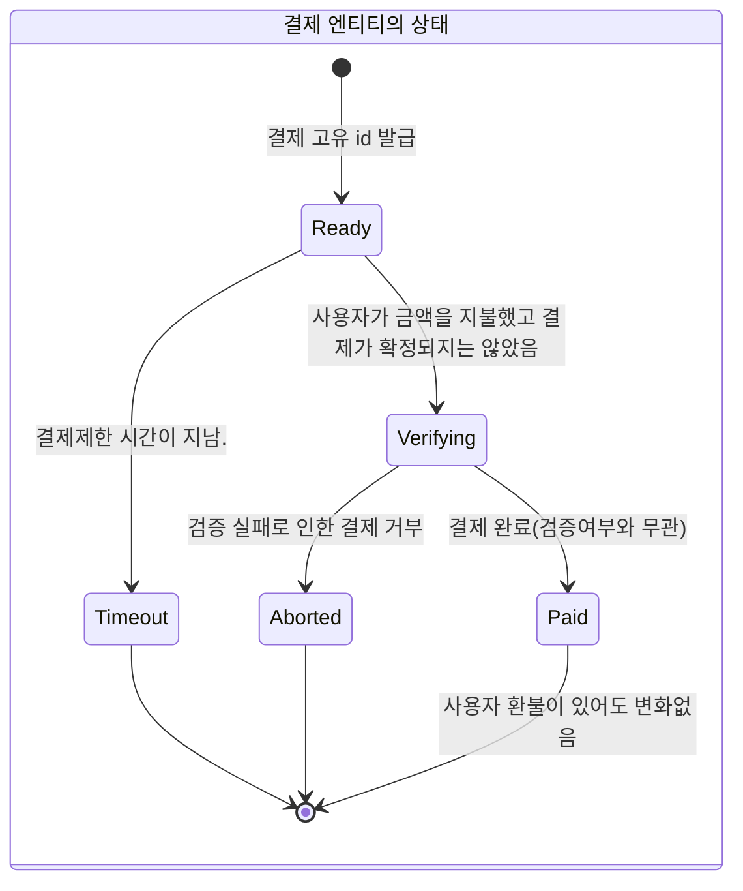

Paid는 사용자가 환불을 요청해도 그 상태를 변경하지 않는다.
결제 취소에 대한 상태는 PaymentCancel에 의해서 관리하도록 할 것

## PaymentCancel의 상태

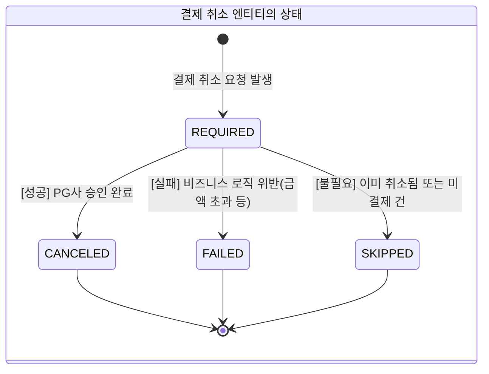

- 재시도 해야하는 경우 상태를 변경하지 않는다.

## 결제 성공 시나리오

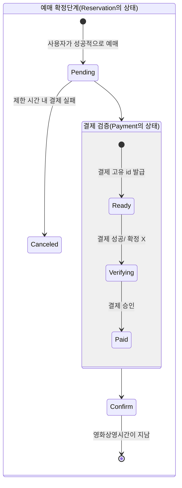

## 결제 거부 시나리오

- 결제 거부란 결제 검증 실패 이후 이미 결제된 금액을 환불하는 보상 의미한다

### 상태다이어그램

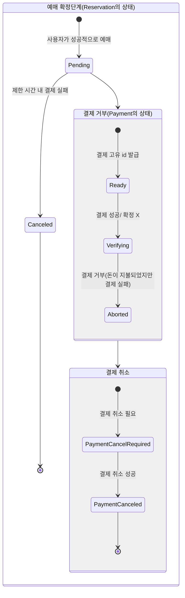

### 결제 거부에 대한 보상 트랜잭션

#### 성공시나리오

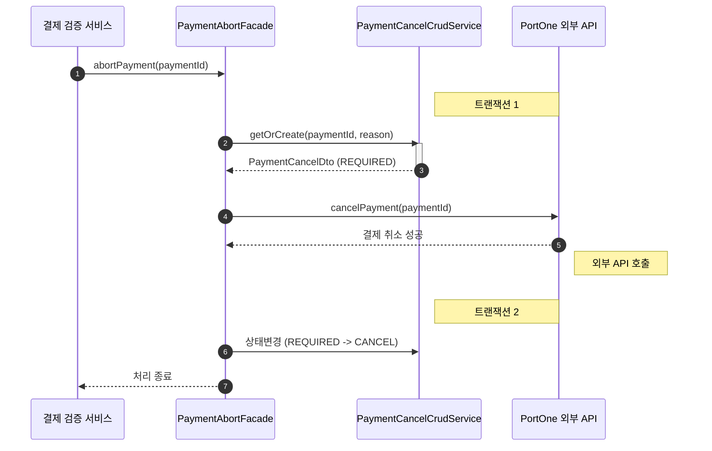

#### 외부 API 연동 실패 시나리오

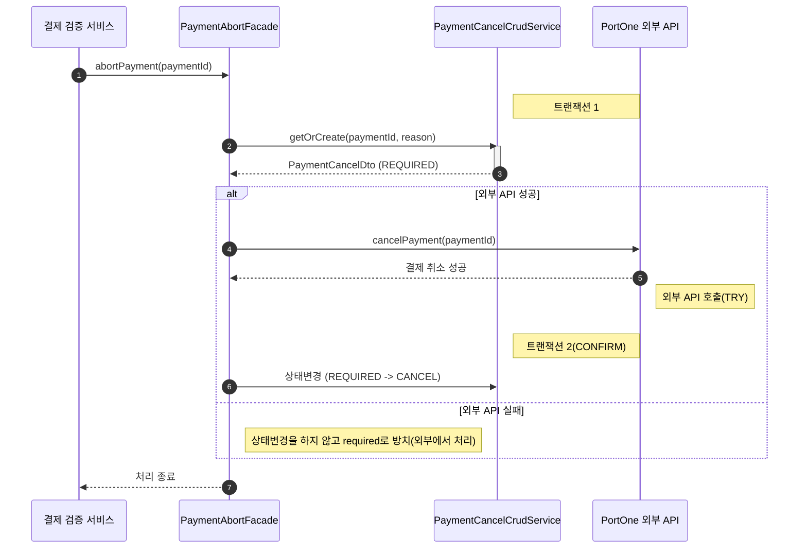

#### 트랜잭션 2 Confirm / Cancel 실패 시나리오

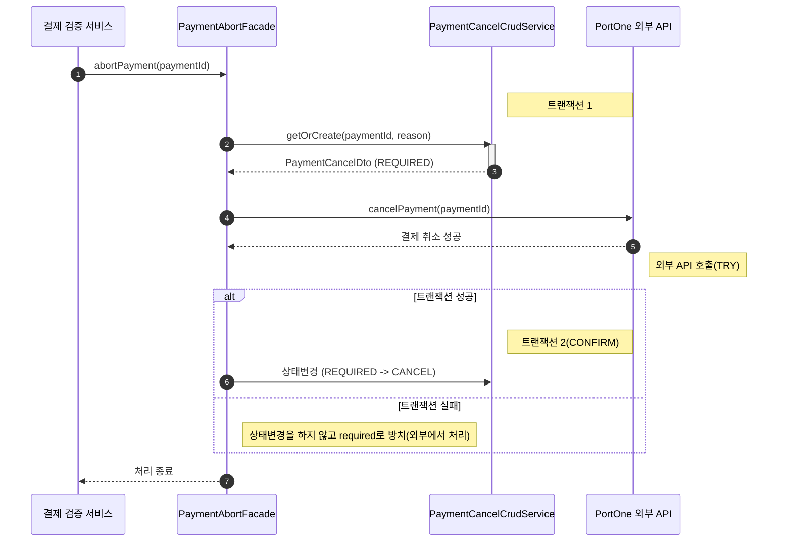

#### 결론

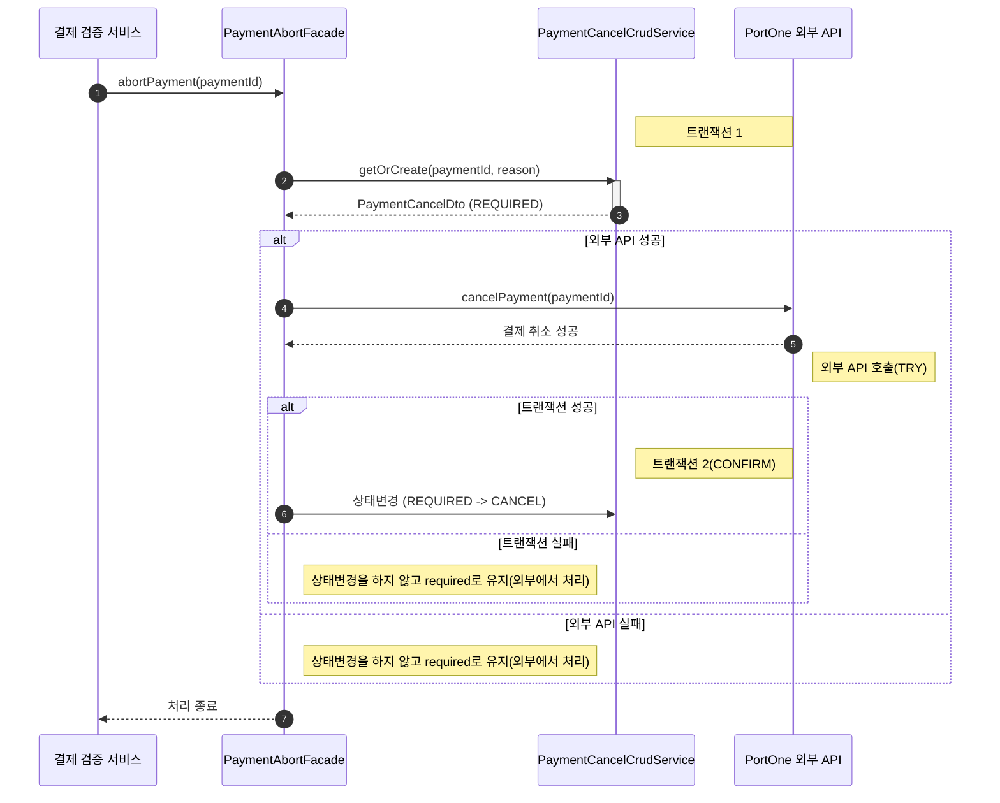

## 예매 취소 시나리오

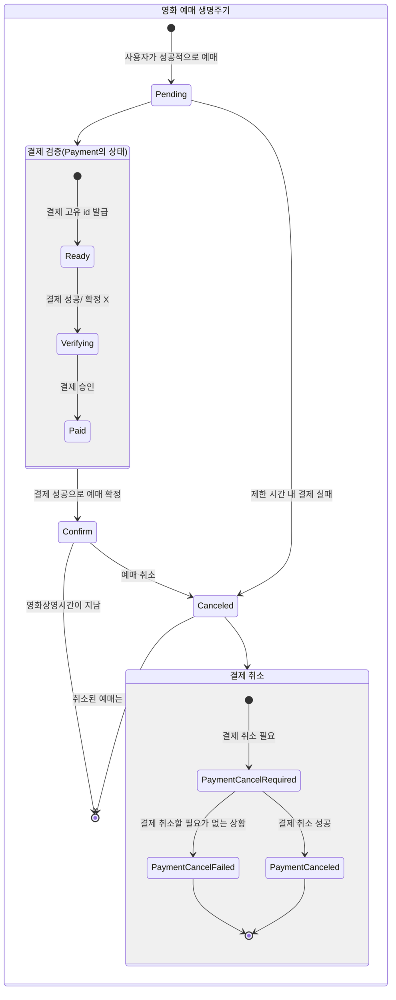

### 시퀀스 다이어그램

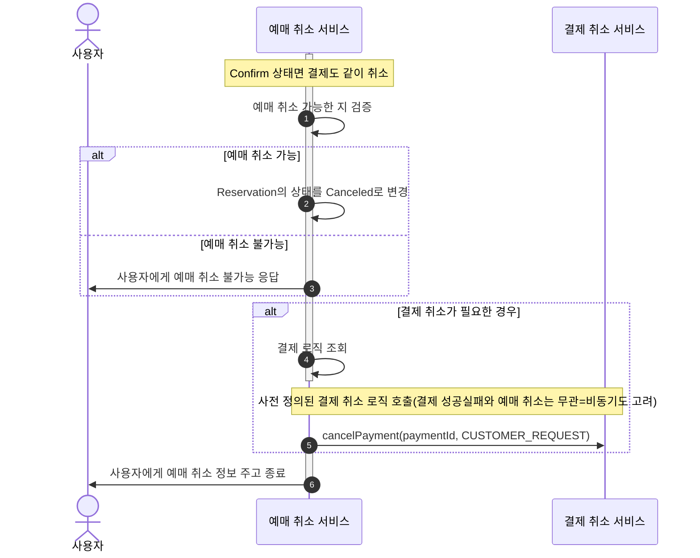

## 시퀀스 다이어그램

### 결제 전반

#### 결제 전체 시스템

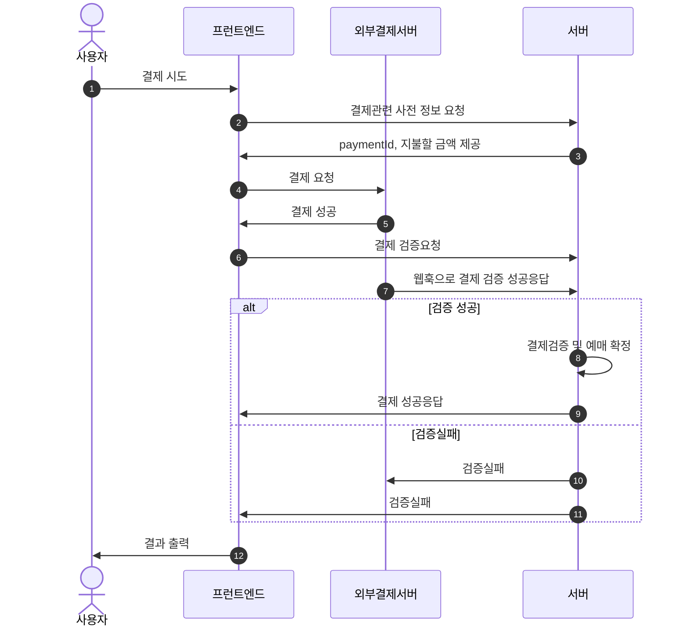

#### 결제 검증 전반

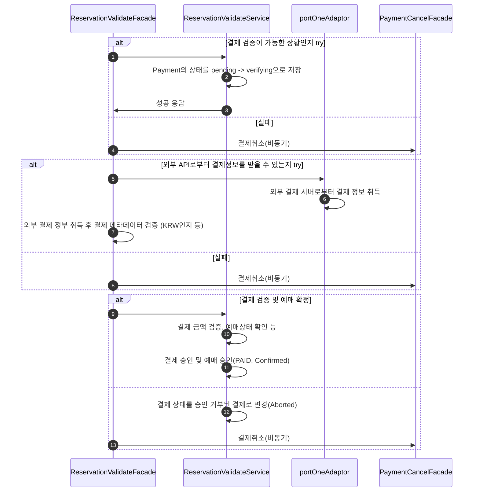
